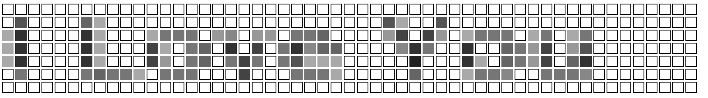

# git-shining: Transform the GitHub contributor graph into living art

This program turns your contributor graph into a work of art by filing commits with the right dates. GitHub will automatically scan the repository and fill out the graph for you.

<p><center></center></p>
<p><center></center></p>

Or [here](https://github.com/erikh?tab=overview&from=1978-12-01&to=1978-12-31) if you want a more in-your-face example.

## Constraints

Best to create or use a burner account for this; this is not for your main account.

- You must have no other activity for the year, which includes pull requests, issue comments, etc.
- You must only have one repository recording commits for the year, and it must be all commits related to your message.
- GitHub will let you back-date your commits to 1970/1/1 so be sure to use the `--origin` option if you want to exploit that.

## Usage

The first step is to generate configuration. You can do this in two ways:

```
git-shining generate-config <json|txt>
```

This will generate a blank canvas for editing in JSON or TXT (more on this later) format.

**or**

```
git-shining render-font <.otf or .ttf file> <message (be sure to quote)>
```

This will generate a pre-filled configuration with the message rasterized to the canvas in the font provided.

Then, you can generate a repository with the `generate-repository` command. Be sure to at least set the `email` field of the person you want getting credit for the commits, it must map directly to a configured GitHub email:

```
git-shining generate-repository -i bro.txt -e wearelegion@example.org -m "Sup Bro" /tmp/test.git
```

After that, you can create your repository and upload it.

If you want to generate repositories that start the graph at a certain date, look at the `--origin` options of `build` and `generate-repository`.

## Configuration Formats and Usage

There are two formats for configuration: JSON and TXT.

JSON is a JSON array of integers, from 0-10, which coordinate to shading in the graph (made possible by filing more commits for brighter shades). It is easy to consume, post-process, and generate, but a little hard to edit.

TXT is an easier format to hand-edit. It is simply a well-aligned grid of integers, which you can set from 0-`A` (`A` is 10 here) to affect shading.

The `generate-config` sub-command can generate both formats for hand-editing, and the `render-font` command has switches to modify target configuration output.

For example, here's the JSON format generated from:

```
git-shining render-font RobotoCondensed-Varablefont_wght.ttf "I Love You" >out.json
```

```json
[
    0, 0, 0, 0, 0, 0, 0, 0, 0, 0, 0, 0, 0, 0, 0, 0, 0, 0, 0, 0, 0, 0, 0, 0, 0,
    0, 0, 0, 0, 0, 0, 0, 0, 0, 0, 0, 0, 0, 0, 0, 0, 0, 0, 0, 0, 0, 0, 0, 0, 0,
    0, 0, 0, 0, 6, 1, 0, 0, 0, 0, 6, 1, 0, 0, 0, 0, 0, 0, 0, 0, 0, 0, 0, 0, 0,
    0, 0, 0, 0, 0, 0, 0, 0, 0, 0, 0, 2, 5, 0, 0, 0, 6, 1, 0, 0, 0, 0, 0, 0, 0,
    0, 0, 0, 0, 0, 0, 0, 9, 1, 0, 0, 0, 0, 8, 2, 0, 0, 0, 0, 2, 5, 4, 5, 1, 0,
    5, 1, 0, 2, 3, 0, 2, 4, 4, 4, 0, 0, 0, 0, 0, 5, 6, 0, 7, 4, 0, 0, 4, 4, 4,
    4, 0, 0, 6, 0, 0, 3, 3, 0, 0, 9, 1, 0, 0, 0, 0, 8, 2, 0, 0, 0, 0, 9, 0, 0,
    1, 9, 0, 3, 6, 0, 8, 1, 1, 11, 3, 3, 7, 5, 0, 0, 0, 0, 0, 6, 8, 4, 0, 0, 5,
    6, 0, 0, 6, 4, 0, 9, 1, 0, 5, 5, 0, 0, 9, 1, 0, 0, 0, 0, 8, 2, 0, 0, 0, 0,
    9, 1, 0, 1, 8, 0, 0, 7, 7, 4, 0, 1, 9, 1, 1, 1, 1, 0, 0, 0, 0, 0, 1, 9, 0,
    0, 0, 4, 6, 0, 0, 6, 4, 0, 9, 1, 0, 9, 5, 0, 0, 5, 0, 0, 0, 0, 0, 4, 5, 4,
    4, 3, 0, 1, 4, 4, 4, 1, 0, 0, 1, 7, 0, 0, 0, 2, 4, 4, 4, 1, 0, 0, 0, 0, 0,
    0, 5, 0, 0, 0, 0, 3, 4, 4, 3, 0, 0, 2, 5, 4, 4, 3, 0, 0, 0, 0, 0, 0, 0, 0,
    0, 0, 0, 0, 0, 0, 0, 0, 0, 0, 0, 0, 0, 0, 0, 0, 0, 0, 0, 0, 0, 0, 0, 0, 0,
    0, 0, 0, 0, 0, 0, 0, 0, 0, 0, 0, 0, 0, 0, 0, 0, 0, 0, 0, 0, 0
]
```

This can then be used with the `build` subcommand to generate a test grid:

```
git-shining build out.json >out.html
```

It looks like this:

<p><center></center></p>

After that, you can confirm it looks the way you want (try different fonts) and lands on the right dates. Use the origin (`-o`) option to modify it, hover over each pixel to see what date it lands on.

Finally, we can generate our repository and upload it:

```
git-shining generate-repository -i out.json -e goodmorning@example.org -m "What a happy day" /tmp/love.git
GIT_DIR=/tmp/love.git git remote add origin https://my/git/repository
GIT_DIR=/tmp/love.git git push origin main -u
# optional, as you don't need it anymore
rm -rf /tmp/love.git
```

## Troubleshooting

- If you upload twice, you must fully delete the old repository and re-create it. Force pushes will not clear the graph.
- If you're wondering what your graph will look like before you push to GitHub, try the `build` sub-command which will generate a HTML mock of the graph you can load into your browser. You can hover over each square to get the expected date.

## Future Plans

- Marquee and Mural functionality

## Author

The Professional <erik+github@hollensbe.org>
